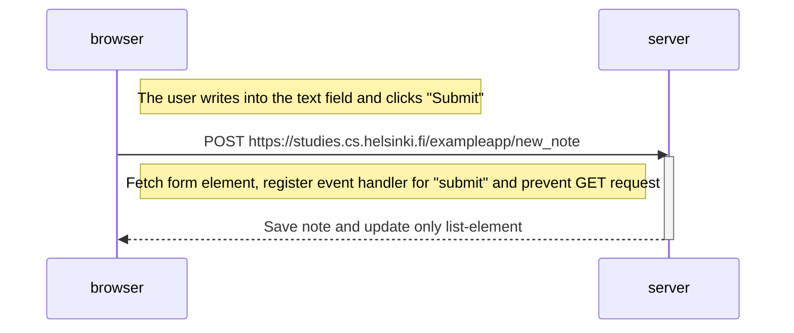

Sekvenssikaavio uuden muistiinpanon luomisesta single page app-versiossa:

```mermaid
sequenceDiagram
    participant browser
    participant server

    Note right of browser: The user writes into the text field and clicks "Submit"

    browser->>server: POST https://studies.cs.helsinki.fi/exampleapp/new_note
    activate server
    Note left of server: Fetch form element, register event handler for "submit" and prevent GET request
    server-->>browser: Save note and update only list-element
    deactivate server
```
